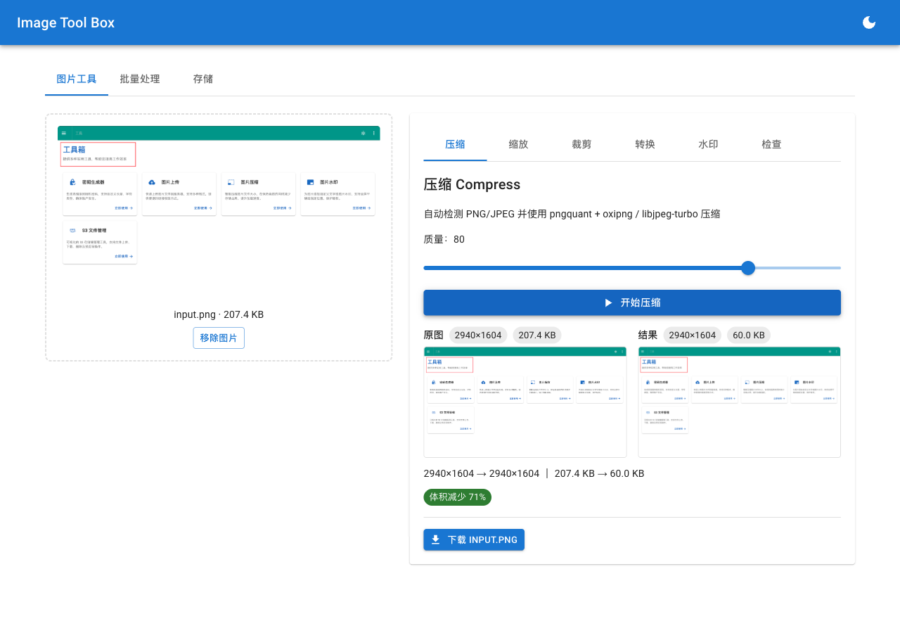

<p align="center">
  
</p>

# Go Image Toolbox

> **中文文档**：[README.md](./README.md)

> External dependencies are documented in [docs/build-bins.md](docs/build-bins.md).
> 
> CI builds the following platforms in parallel:
> 
> - macOS amd64 / arm64
> - Linux amd64 / arm64
> - Windows amd64 / arm64
> 
> Release artifacts: macOS / Linux are packaged as `.tar.gz`, Windows as `.zip`; Windows executables and the bundled compression tools all carry the `.exe` extension.

## Install

After a new version is released, install it with Homebrew (macOS / Linux):

```bash
brew tap lz-wang/tap
brew install lz-wang/tap/itb
```

> [!WARNING]
> **macOS runtime note**
>
> If running the binary on macOS reports "cannot verify developer", and you have to manually allow it under "Security & Privacy" every time, for internal use you can strip the `quarantine` attribute right after downloading or extracting:
>
> ```bash
> xattr -d com.apple.quarantine your_binary
> ```

## Compress images

Auto-detects the image format (PNG/JPEG) and compresses it:

```bash
# Compress a PNG (overwrites the original)
./itb compress -i photo.png

# Compress a JPEG (overwrites the original)
./itb compress -i photo.jpg

# Specify the output file
./itb compress -i photo.png -o compressed.png

# Specify compression quality (1-100, default 80)
./itb compress -i photo.jpg -q 90
```

<details>
<summary>Options & compression pipeline</summary>

| Option | Description |
|------|------|
| `-i, --input` | Input image file path |
| `-o, --output` | Output image file path (overwrites the original if omitted) |
| `-q, --quality` | Compression quality 1-100 (default 80) |

**Compression pipeline**

- **PNG**: `pngquant` → `oxipng` (lossy + lossless, two-stage compression)
- **JPEG**: `djpeg` → `cjpeg` (libjpeg-turbo decode + encode)

</details>

## Crop images

Keep a region of the image by anchor and percentage.

```bash
# Keep the left 40% of the width
./itb crop -i a.jpg --anchor left --width 40%

# Keep the right 40% of the width
./itb crop -i a.jpg --anchor right --width 40%

# Keep the top-left 40% x 40% region
./itb crop -i a.jpg --anchor top-left --width 40% --height 40%

# Keep the center 40% x 40% region
./itb crop -i a.jpg --anchor center --width 40% --height 40%
```

<details>
<summary>Options & rules</summary>

| Option | Default | Description |
|------|--------|------|
| `-i, --input` | (required) | Input image path |
| `-o, --output` | `*_cropped.*` | Output path; appends `_cropped` to the original name by default |
| `--anchor` | (required) | Crop anchor: `left` / `right` / `top` / `bottom` / `top-left` / `top-right` / `bottom-left` / `bottom-right` / `center` |
| `--width` | | Crop width as a percentage, e.g. `40%` |
| `--height` | | Crop height as a percentage, e.g. `40%` |

**Rules**

- Only the percentage format is supported, in the range `(0, 100]`
- `left` / `right` require `--width` and must not provide `--height`
- `top` / `bottom` require `--height` and must not provide `--width`
- `top-left` / `top-right` / `bottom-left` / `bottom-right` / `center` require both `--width` and `--height`

</details>

## Resize images

Resize by width/height, by percentage, or using different modes.

```bash
# Specify the width, scale proportionally
./itb resize -i photo.jpg --width 1200

# Specify a box, preserve aspect ratio (fit)
./itb resize -i photo.jpg --width 1200 --height 630 --mode fit

# Specify a box and crop to fill
./itb resize -i photo.jpg --width 1200 --height 630 --mode fill --anchor top

# Scale by percentage
./itb resize -i photo.png --percent 50%
```

<details>
<summary>Options</summary>

| Option | Default | Description |
|------|--------|------|
| `-i, --input` | (required) | Input image path |
| `-o, --output` | `*_resized.*` | Output path |
| `--width` | | Target width |
| `--height` | | Target height |
| `--percent` | | Scale by percentage, e.g. `50%` |
| `--mode` | `fit` | Resize mode: `fit` / `fill` / `stretch` |
| `--anchor` | `center` | Anchor for `fill` mode |
| `--filter` | `lanczos` | Resampler: `nearest` / `linear` / `catmullrom` / `lanczos` |

</details>

## Format conversion

Convert between `jpg/jpeg/png/webp`; the output format is set by `--to`.

```bash
# Convert to WebP
./itb convert -i photo.png --to webp

# Transparent PNG → JPG with a custom background color
./itb convert -i photo.png --to jpg --background "#FFFFFF"

# Specify the output path
./itb convert -i photo.jpg --to png -o output.png
```

<details>
<summary>Options</summary>

| Option | Default | Description |
|------|--------|------|
| `-i, --input` | (required) | Input image path |
| `-o, --output` | `*_converted.<ext>` | Output path |
| `--to` | (required) | Target format: `jpg` / `jpeg` / `png` / `webp` |
| `-q, --quality` | `80` | Quality for lossy formats |
| `--lossless` | `false` | Lossless encoding (webp/png) |
| `--background` | `#FFFFFF` | Background color when converting to an opaque format |

</details>

## Watermark

Add text watermarks to images, supporting two modes: position (single point) and repeated tile.

### Position watermark (position)

Adds a single watermark at the specified position. The text color (black/white) is chosen automatically based on background brightness, with an outline for readability.

```bash
# Default: bottom-right
./itb watermark -i photo.jpg -t "© Author"

# Specify the position
./itb watermark -i photo.png -t "Copyright" --position center

# Adjust opacity
./itb watermark -i photo.png -t "Author" --opacity 0.8

# Specify the output path
./itb watermark -i photo.jpg -t "Author" -o output.jpg

# Image watermark
./itb watermark -i photo.jpg --image logo.png --scale 0.2 --position bottom-right
```

### Repeated tile watermark (repeat)

Text is tiled across the whole image, with adjustable rotation angle and spacing.

```bash
# Basic usage
./itb watermark -i photo.png -t "WATERMARK" --mode repeat

# Custom angle and opacity
./itb watermark -i photo.png -t "DRAFT" --mode repeat --angle 45 --opacity 0.3

# Custom color
./itb watermark -i photo.png -t "CONFIDENTIAL" --mode repeat --color "#FF0000"
```

<details>
<summary>Options</summary>

**Common options**

| Option | Default | Description |
|------|--------|------|
| `-i, --input` | (required) | Input image path |
| `-t, --text` | Required unless using `--image` | Watermark text |
| `-o, --output` | `*_watermarked.*` | Output path; appends `_watermarked` to the original name by default |
| `-m, --mode` | `position` | Watermark mode: `position` / `repeat` |
| `--color` | (auto) | Watermark color, e.g. `#FF0000`; empty = auto black/white |
| `--opacity` | `0.5` | Opacity, range 0–1 |
| `--font-size` | `0` | Font size; `0` = computed from the image |
| `--font` | (auto) | Font file path; empty = auto system font |
| `--image` | Required unless using `--text` | Image watermark path |
| `--scale` | `0.2` | Image watermark scale, relative to the shorter side of the base image |
| `--tile` | `false` | Tile image watermark (not supported in this version) |

**position mode options**

| Option | Default | Description |
|------|--------|------|
| `--position` | `bottom-right` | Position: `bottom-right` / `bottom-left` / `top-right` / `top-left` / `center` |
| `--margin` | `0.04` | Margin ratio, relative to the shorter side of the image |

**repeat mode options**

| Option | Default | Description |
|------|--------|------|
| `--angle` | `30` | Rotation angle (degrees) |
| `--space` | `0` | Tile spacing; `0` = auto-computed from font size |

</details>

## Image inspection

Read file info, basic image info, detailed metadata, and file hash.

```bash
# Default table output; computes all hashes; prints detailed data
./itb inspect -i photo.jpg

# JSON output
./itb inspect -i photo.jpg --format json

# Print only sha256
./itb inspect -i photo.jpg --format plain

# Disable detailed data
./itb inspect -i photo.jpg --detail=false

# Skip hash computation
./itb inspect -i photo.jpg --no-hash
```

<details>
<summary>Options</summary>

| Option | Default | Description |
|------|--------|------|
| `-i, --input` | (required) | Input image path |
| `--format` | `table` | Output format: `table` / `json` / `plain` |
| `--detail` | `true` | Print detailed metadata |
| `--no-hash` | `false` | Skip file hash computation |
| `--strict` | `false` | Return an error immediately if image parsing fails |

</details>

## WebUI (itb serve)

Besides the CLI, `itb` ships a local-first WebUI that shares exactly the same Go image-processing core (the WebUI does not spawn CLI subprocesses; it calls the domain packages directly).

```bash
# Start the WebUI (default http://127.0.0.1:8080)
./itb serve

# Custom listen address
./itb serve --addr 127.0.0.1:9000

# Open the browser after startup
./itb serve --open
```

The frontend bundle is embedded in the binary, so no extra deployment files are needed; CI releases still publish a single `itb` executable.



### Feature scope

- **Image tools**: compress, resize, crop, format conversion, watermark (text/image, font upload supported); image metadata is shown automatically after upload — with Before/After comparison and size delta

### Security boundary

By default the server binds to `127.0.0.1` only; do not expose it to untrusted networks. The WebUI only performs local image processing and never handles external-service credentials.

<details>
<summary>Command options and HTTP API</summary>

| Option | Default | Description |
|------|--------|------|
| `--addr` | `127.0.0.1:8080` | Listen address |
| `--open` | `false` | Open the browser after startup |

The backend API uses the `/api/v1` prefix, for example the health check:

```bash
curl http://127.0.0.1:8080/api/v1/health
```

Image endpoints (`compress` / `resize` / `crop` / `convert` / `watermark` / `inspect`) accept `multipart/form-data`: `file` plus `options` (a JSON string); results are streamed back as raw image bytes.

</details>

<details>
<summary>Building from source</summary>

```bash
make build    # Build the WebUI (npm) then compile itb
make serve    # Build and start the WebUI
make check    # go vet + frontend type-check + lint
make test     # go test + frontend tests
```

For frontend development, run `cd web && npm run dev` (the Vite dev server proxies `/api` to `127.0.0.1:8080`).

</details>

## S3-compatible storage

Supports any S3-protocol-compatible storage: AWS S3, MinIO, Alibaba Cloud OSS, Tencent Cloud COS, etc.

### Environment variables

```bash
ITB_S3_ENDPOINT           # S3 endpoint URL (optional)
ITB_S3_ACCESS_KEY_ID      # Access Key ID
ITB_S3_SECRET_ACCESS_KEY  # Secret Access Key
ITB_S3_REGION             # Region (default us-east-1)
ITB_S3_BUCKET             # Bucket name (can also be set via -b)
```

<details>
<summary>Common options</summary>

All S3 subcommands share the following options:

| Option | Default | Description |
|------|--------|------|
| `-e, --endpoint` | (required) | S3 endpoint URL |
| `-a, --access-key` | (env var) | Access Key ID |
| `-s, --secret-key` | (env var) | Secret Access Key |
| `-r, --region` | `us-east-1` | Region |
| `-b, --bucket` | (required) | Bucket name |
| `--force-path-style` | `false` | Force path-style URL (required by MinIO) |

</details>

### Upload file

```bash
# Upload a file to the bucket
./itb s3 upload -i photo.jpg -b my-bucket -e http://localhost:9000

# Specify the object key (defaults to the file name)
./itb s3 upload -i photo.jpg -b my-bucket -k images/photo.jpg

# Specify the Content-Type
./itb s3 upload -i data.json -b my-bucket --content-type application/json

# Skip when an object with the same key already exists (one HEAD instead of a full upload)
./itb s3 upload -i photo.jpg -b my-bucket --skip-existing

# Skip only when content is unchanged (compares itb-sha256 metadata, not ETag)
./itb s3 upload -i photo.jpg -b my-bucket --skip-unchanged
```

Every upload stores the local file's SHA-256 in object user metadata
(`x-amz-meta-itb-sha256`), which `--skip-unchanged` compares against;
the default behavior remains unconditional overwrite. `--skip-existing`
and `--skip-unchanged` are mutually exclusive upload strategies;
combining them is rejected as a flag error.

<details>
<summary>upload options</summary>

| Option | Default | Description |
|------|--------|------|
| `-i, --input` | (required) | Local file path |
| `-k, --key` | file name | Object key |
| `--content-type` | auto-detected | Content type |
| `--skip-existing` | `false` | Skip upload when the object key already exists |
| `--skip-unchanged` | `false` | Skip upload only when content is unchanged (compares itb-sha256 metadata) |

</details>

### Download file

```bash
# Download a file
./itb s3 download -b my-bucket -k photo.jpg -o ./photo.jpg

# Use the object key as the local file name
./itb s3 download -b my-bucket -k images/photo.jpg
```

<details>
<summary>download options</summary>

| Option | Description |
|------|------|
| `-k, --key` | Object key (required) |
| `-o, --output` | Local output path (defaults to the object key) |

</details>

### Delete object

```bash
# Delete an object (confirmation required)
./itb s3 delete -b my-bucket -k photo.jpg

# Force delete (no confirmation)
./itb s3 delete -b my-bucket -k photo.jpg -f
```

<details>
<summary>delete options</summary>

| Option | Description |
|------|------|
| `-k, --key` | Object key (required) |
| `-f, --force` | Force delete without confirmation |

</details>

### List objects

```bash
# List all objects
./itb s3 list -b my-bucket

# Filter by prefix
./itb s3 list -b my-bucket -p images/

# JSON output
./itb s3 list -b my-bucket --format json
```

<details>
<summary>list options</summary>

| Option | Default | Description |
|------|--------|------|
| `-p, --prefix` | | Object key prefix |
| `--max-keys` | `1000` | Maximum number of results |
| `--format` | `table` | Output format: `table` / `json` / `plain` |

</details>

### Stat object metadata

```bash
# Show full metadata of a single object (one HEAD request, no content transfer)
./itb s3 stat -b my-bucket -k images/photo.jpg

# JSON output
./itb s3 stat -b my-bucket -k images/photo.jpg --format json
```

stat always queries by the exact object key and never falls back to list
inference when the object does not exist. The returned metadata includes
Size, ETag, Content-Type, Storage Class, Cache-Control, Version ID and
user metadata.

<details>
<summary>stat options</summary>

| Option | Default | Description |
|------|--------|------|
| `-k, --key` | (required) | Object key |
| `--format` | `table` | Output format: `table` / `json` |

</details>

<details>
<summary>Cloud provider configuration examples</summary>

| Provider | Endpoint example | ForcePathStyle |
|---------|---------------|----------------|
| AWS S3 | `https://s3.amazonaws.com` | `false` |
| MinIO | `http://localhost:9000` | `true` |
| Alibaba Cloud OSS | `https://oss-cn-hangzhou.aliyuncs.com` | `false` |
| Tencent Cloud COS | `https://cos.ap-guangzhou.myqcloud.com` | `false` |

</details>

## License

This project is released under the MIT license. For the bundled third-party tools, see [LICENSE-THIRD-PARTY.md](./LICENSE-THIRD-PARTY.md).
